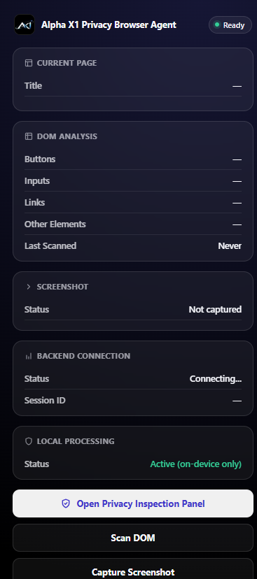
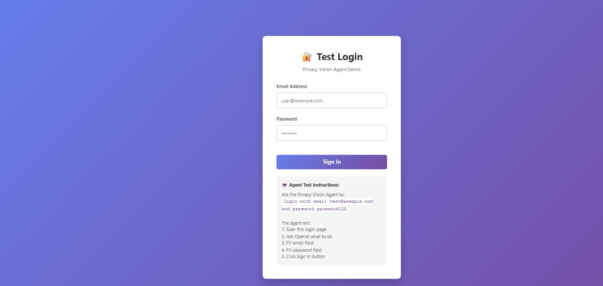

# Privacy Vision Agent

A privacy-preserving browser agent: a lightweight on-device vision/DOM pipeline detects and redacts sensitive information locally, before any context is sent to a cloud reasoning model. The cloud model reasons over sanitized data only and returns structured actions, which are validated and executed locally.

**SEE LOCALLY → PROTECT LOCALLY → REASON IN CLOUD → VALIDATE LOCALLY → ACT LOCALLY**

## Screenshots

The extension popup — current page info, DOM analysis, screenshot capture, and backend/session status:



The bundled demo site, used for local development and privacy evaluation:



## Project layout

```
privacy-vision-agent/
├── backend/        FastAPI gateway — sessions, WebSocket comms, provider routing
├── extension/       Chrome extension (Vite + React + TS) — capture, redaction, execution
├── demo-site/       Synthetic PII test page used for development and demos
├── shared/          Shared types/utilities
└── README.md        Full build specification and architecture notes
```

## Components

- **Browser extension** — captures the current tab/DOM, runs local detection/redaction (including an in-browser vision model), builds a sanitized context, and executes validated actions. Built with Vite, React, and TypeScript.
- **Backend / agent gateway** — FastAPI service that manages agent sessions over WebSocket, routes sanitized context to a cloud reasoning provider (Claude, OpenAI, or a local Ollama model), and converts model output into a strict action protocol.
- **Demo site** — a local test page with realistic but fully synthetic credentials, used to exercise and demo the end-to-end flow safely.

## Getting started

### Backend

```bash
cd privacy-vision-agent/backend
pip install -r requirements.txt
cp ../.env.example ../.env   # fill in your API key(s)
uvicorn app.main:app --reload
```

### Extension

```bash
cd privacy-vision-agent/extension
npm install
npm run dev      # local development
npm run build     # production build for loading as an unpacked extension
```

### Demo site

```bash
cd privacy-vision-agent/demo-site
python -m http.server 8000
# open http://localhost:8000
```

## Security principles

- Raw sensitive data (passwords, credentials, payment/ID numbers, personal contact info) never intentionally crosses the network boundary.
- The cloud model only ever sees a sanitized, redacted representation of page context.
- All cloud-proposed actions are validated locally before execution.

See [`privacy-vision-agent/README.md`](privacy-vision-agent/README.md) for the full build specification, and [`privacy-vision-agent/OPERATIONS.md`](privacy-vision-agent/OPERATIONS.md) / [`privacy-vision-agent/DECISIONS.md`](privacy-vision-agent/DECISIONS.md) for operational notes and design decisions.
